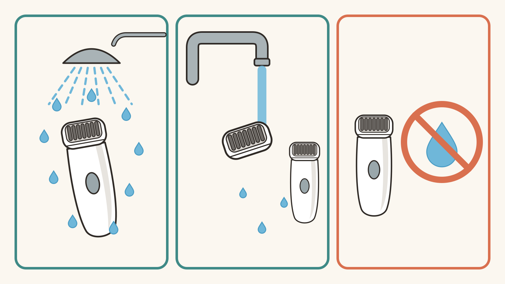
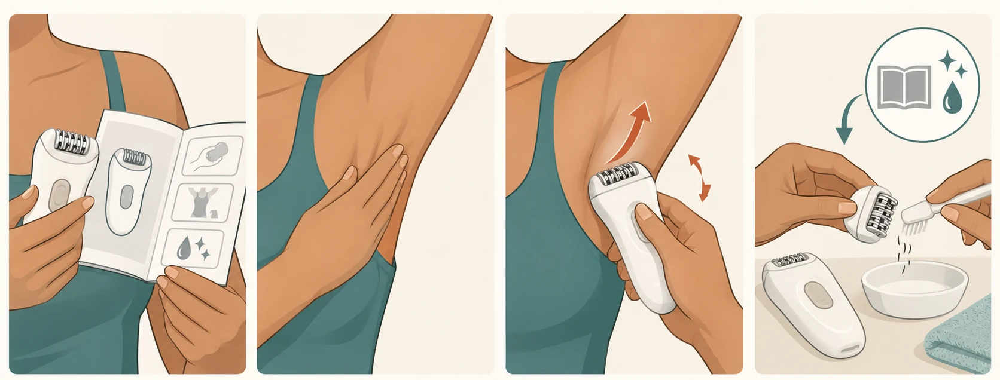
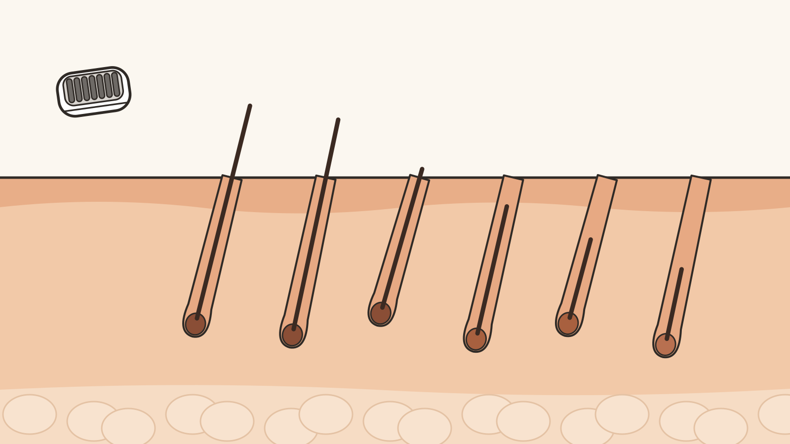

# How to Epilate Underarms Safely

<!-- CMS: Internal editorial metadata. Do not render this block as consumer-facing copy.
**SEO title:** How to Epilate Underarms Safely - Step-by-Step Guide  
**Slug:** `/skin-care/how-to-epilate-underarms/`  
**Primary keyword:** how to epilate underarms  
**Meta description:** Learn how to epilate underarms using your exact device instructions, controlled technique, and clear stop signs for cuts or worsening irritation.  
**Evidence model:** Research-based guide using exact-model instructions, official manufacturer support, and already-reviewed public health guidance (AAD, MedlinePlus, NHS), directly attributed rather than synthesized into WhoAdvice's own clinical framework; WhoAdvice did not conduct hands-on testing and this guide does not offer medical advice  
**Target market:** United States  
**Research date:** July 20, 2026; sources re-verified live and current September 29, 2026 (AAD 2/11/22, MedlinePlus reviewed 10/14/2025, NHS reviewed 09/2026); rewritten the same day so every reaction and wound-care line reports one named source's own guidance rather than a WhoAdvice-authored escalation framework, since no in-house qualified medical reviewer is available to approve original synthesis  
**Commercial disclosure:** This informational guide contains no affiliate links or product recommendations.
-->

Can you epilate your underarms with the device you already own? Only if the manufacturer permits your exact epilating head and attachment for that area. An included shaver or trimmer does not automatically mean the epilating head is suitable there. You should also check the manual’s warnings for your current skin condition before proceeding.

The safe answer to how to epilate underarms is not one universal routine. Hair length, wet or dry use, attachment, angle, speed, and cleaning rules vary between devices. For example, current instructions for some cordless Philips models differ from the support available for a corded model.

This guide follows exact product instructions for technique. For cuts and reactions, it reports what the American Academy of Dermatology (AAD), MedlinePlus, and the NHS already publish, rather than WhoAdvice's own medical judgment.

## Before you epilate your underarms

Find the model number, then open its current instructions. Confirm that the underarm directions cover epilation; shaving or trimming permission is not enough. If you still need a device, [compare epilators for different treatment areas](/skin-care/best-epilators/) rather than choosing from the examples below.

Check the skin warnings in the manual and do not proceed if it says not to use the device on your skin in its current condition. The head should also be clean, correctly fitted, and undamaged.

- **Cordless wet/dry:** confirm wet or dry permission, angle, attachment, and hair length.
- **Corded:** confirm wet-use limitations, angle, cap, and cleaning rules.
- **Washable-head only:** confirm which parts can be rinsed after unplugging.

A washable head does not prove that the handle is shower-safe. The exact model’s symbols and instructions control.

> [!CAUTION]
> **Stop before you begin:** Do not proceed if the manual says not to use the device on the current skin condition or situation. Stop if epilation cuts the skin, causes bleeding, or produces unusual, severe, or worsening pain.

<!-- IMAGE BRIEF: The four-panel underarm-technique illustration, immediately before the numbered steps. Prompt in publisher-handoff.md. The file below is a placeholder until the generated image replaces it at the same path. The illustration supports the steps but does not replace them. -->

## How to epilate underarms step by step

### 1. Check the exact model, head, and cap

Confirm the epilating head is intended for underarms, and note the required cap. Don't borrow instructions from another model.

### 2. Check when the manual says not to use it

Read the manual's warnings first. The [Philips BRE708/BRE728 manual (PDF)](https://www.documents.philips.com/assets/20251218/e0b425ee1d6c4683af1ab3b700f9d4d0.pdf) excludes skin that's damaged, inflamed, irritated, or healing.

**Tip:** Not sure a warning applies to your skin? Check with a doctor before continuing, rather than guessing.

### 3. Inspect and clean the epilating head

Check that the head is intact, correctly attached, and clean. Stop using a damaged or worn head — don't press harder to compensate.

### 4. Match the hair length to the manual

Trim only when instructed. Philips specifies 3–4 mm for BRE708/00 and BRE728/00 — don't apply that range to another epilator.

### 5. Choose wet or dry use correctly

BRE708/00 and BRE728/00 permit fully wet or fully dry use. Philips says dry use may catch hair more effectively.

**Tip:** BRE227/00 is corded — keep it out of wet-use settings unless its exact instructions explicitly permit that.

### 6. Prepare only as directed

Follow the manual rather than adding powder, oil, acids, antiseptic, ice, or numbing products — none of these are an established routine.

### 7. Raise your arm and stretch the skin

Lift the arm and hold the skin taut with your free hand, without pulling painfully.

**Tip:** This can improve control, but it won't guarantee comfort or prevent injury.

### 8. Use the specified angle and cap

For BRE708/00 and BRE728/00, use 75° without ProGuide, or keep ProGuide flat. [BRE227/00's attachment guidance](https://www.usa.philips.com/c-f/XC000020632/how-do-i-use-the-attachments-of-my-philips-epilator) names a delicate-area cap, not an angle.

### 9. Move slowly with light pressure

Move slowly with gentle, even pressure against hair growth. Reposition rather than repeat one spot, and stop for a cut, bleeding, or unusual pain.

**Tip:** Pause before switching sides. Don't continue automatically if the first underarm is bleeding, cut, or increasingly irritated — treat each side on its own.

### 10. Clean the device exactly as directed

Switch off or unplug first. Follow the water symbols for the head, attachments, and handle — each may carry a different rating.

### 11. Finish and assess the skin

Finish as the manual directs, then check the skin before applying anything. Use wound care, not cosmetic aftercare, for a cut or bleeding.

## What to do immediately after epilation

Keep device cleaning and skin care separate. Switch off or unplug the epilator and clean only the parts its instructions permit you to rinse or brush.

Philips permits a mild alcohol-free lotion or cream after use in the cited BRE708/BRE728 manual. Support applying to BRE227/00 also permits alcohol-free deodorant, but this does not create a universal deodorant rule or waiting period. Follow the guidance for your model and assess the skin first. Do not put cosmetic aftercare on an open or bleeding area; stop and use appropriate cut care instead.

## Redness, tenderness, bleeding, and other reactions

Stop epilating. If the cut is bleeding, apply firm direct pressure with clean gauze or a clean cloth. For a minor cut, the [American Academy of Dermatology](https://www.aad.org/public/everyday-care/injured-skin/burns/treat-minor-cuts) recommends washing it with mild soap and water, applying petroleum jelly rather than a topical antibiotic, and covering it with a sterile bandage.

Philips support applying to BRE227/00 says temporary itchiness, redness, tightness, small bumps, or a burning sensation can occur after epilation. There is no reliable fixed recovery time for every person. Philips advises consulting a doctor if irritation lasts longer than three days, but do not wait for that point when symptoms are severe or worsening.

[MedlinePlus](https://medlineplus.gov/ency/article/000043.htm) advises contacting your health care provider right away if a wound shows warmth and redness in the area, a painful or throbbing sensation, fever, swelling, a red streak extending from the wound, or pus-like drainage, and calling 911 or your local emergency number if bleeding is severe or does not stop after about ten minutes of firm pressure. These are that source's own guidelines for a cut or wound, not WhoAdvice's diagnosis of your reaction.

Plucking-type hair removal can also contribute to ingrown hairs. [NHS guidance](https://www.nhs.uk/conditions/ingrown-hairs/) says not to scratch, pick, or squeeze one, and to see a GP if an ingrown hair or the area around it is very painful, hot, or swollen, or if you have a high temperature or feel hot, cold, shivery, or generally unwell. These are the NHS's own signs for when to get care; they do not establish a diagnosis from this article or a photograph.

For recurrent irritation or ingrown hairs, or if a skin condition makes the manual's warnings unclear, see a doctor rather than working from this page alone.

## Why underarm hair may appear again within days

Visible hair after a few days does not have one certain explanation. The epilator may have missed some hairs, or some may have been too short or too long for effective pickup. A dirty or damaged head, excessive pressure, fast movement, the wrong angle, or poor skin tension can also reduce pickup or contribute to breakage.

Other hairs may have been below the skin or too short to catch during the previous session and become visible later. Check the head and technique, then compare the result with your manual’s instructions. Do not assume that every visible hair broke. Brand language such as “up to four weeks” describes a possible maximum, not a guaranteed result for each session.

## Epilating versus waxing, shaving, trimming, or IPL

Base the choice on your tolerance for root removal, the skin response, and the applicable eligibility limits.

| Method | Main distinction | When you may prefer it | Important limitation |
|---|---|---|---|
| Epilation | Mechanical root removal | The exact device permits underarms | Technique and reactions need control |
| Waxing | Root removal with wax | You prefer another root-removal process | Pain, irritation, and hot-wax burns can occur |
| Shaving | Cuts hair at skin level | Speed matters most | Cuts, irritation, and ingrown hairs can occur |
| Trimming | Shortens hair | Root removal is not manageable | Leaves visible or stubbly hair |
| IPL | Light-based reduction | You meet the device’s eligibility rules | Has separate skin-tone, hair-color, and safety limits |

IPL is not an epilator type. Unlike mechanical root removal, it requires a separate eligibility check, treatment schedule, and safety review before use.

## Questions about underarm epilation

### Can you use an epilator on your underarms?

Yes, but only when the manufacturer permits the exact epilating head and attachment for underarm use. Check the model and manual; an included shaving head may have different restrictions. Do not proceed when its skin or health warnings apply. Ask the manufacturer if the permitted area remains unclear.

The device-check section above shows why area permission must follow the exact head rather than the package name.

### How long should underarm hair be before epilating?

Use the hair-length range in your exact instructions. The Philips BRE708/00 and BRE728/00 manual specifies 3–4 mm and advises trimming longer hair first. Other models may differ, so use the length-check step above rather than guessing a universal range.

Hair outside the stated range may be harder for that particular head to catch efficiently.

### Is it better to epilate underarms wet or dry?

Neither wet nor dry use is universally better; the epilator must permit the chosen setting. BRE708/00 and BRE728/00 allow completely wet or dry use, while Philips says dry use may catch hair more effectively. Follow the wet/dry step above because comfort preference does not override the water rating.

A washable removable head alone does not make the handle safe for shower use.

### Is bleeding after underarm epilation normal?

Stop epilating if the skin bleeds. Apply firm direct pressure and follow the cut-care guidance above; MedlinePlus advises calling 911 if bleeding is severe or does not stop after about ten minutes of pressure. Do not continue automatically on the other underarm.

After bleeding is controlled, clean and cover a minor cut as the reaction section explains.

### How long can redness or tenderness last?

There is no fixed duration that applies to everyone. Philips describes several temporary reactions and advises medical consultation if irritation lasts longer than three days. Follow the escalation signs above and seek advice sooner for severe or worsening symptoms.

Increasing warmth, swelling, drainage, fever, or a red streak from the area also warrants prompt medical advice, per MedlinePlus.

### Why is hair visible again after only a few days?

Some hairs may have been missed, outside the usable length range, broken during poor pickup, or below the skin earlier. Use the troubleshooting section above to check the head and technique. These remain possibilities, and a brand’s maximum-duration claim is not an individual guarantee.

No single visible clue proves which explanation applies to an individual hair.

### Can you apply deodorant after epilating?

Check the exact manufacturer guidance and assess the skin before applying deodorant. Philips support applying to BRE227/00 permits alcohol-free deodorant, but no universal waiting period was established. Follow the aftercare section above, and do not apply cosmetics to cut or irritated skin.

Permission in one model’s support page does not establish a rule for every epilator.

## When underarm epilation is not the right method

Skip underarm epilation when the manufacturer does not permit the exact head or attachment, when its skin warnings apply, or when root removal repeatedly causes a reaction you cannot manage. Follow the approved hair length, setting, angle, cap, pressure, and cleaning rules whenever you proceed. Stop for a cut, bleeding, worsening irritation, or unusual, severe, or worsening pain. Shaving, trimming, waxing, or a separately evaluated IPL device may suit a different need. Seek professional advice for severe, worsening, recurrent, or infection-like symptoms, using AAD, MedlinePlus, or NHS guidance as the basis, not this article's own judgment.
